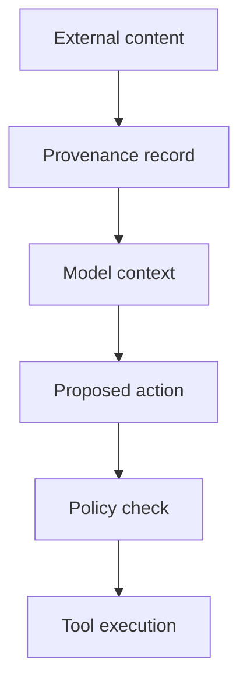

# 02. Four hard-to-reverse decisions

Senior attention is scarce. Spend it on choices that become painful after the system grows around them.

The four decisions in this chapter are ordered by design, not by implementation sequence. A team may prototype a prompt before choosing its durable state store. The architecture review still has to force all four into the open before production.

## 1. The model-provider seam

The seam is the owned interface where provider-specific behavior stops.

It should cover the parts of model use that the rest of the product depends on: messages or responses, tool definitions, structured output, streaming, usage, errors, safety events, and trace identifiers. It should not pretend that every provider has identical semantics. A lowest-common-denominator wrapper can hide the very capability you need.

Use a two-part seam:

- a stable product contract above the seam;
- explicit provider adapters and capability flags below it.

The product contract might ask for `extract_claim`, `draft_reply`, or `plan_research` rather than a vendor model name. The adapter may map that task to a model, reasoning setting, tool format, timeout, and retry rule. Contract tests run against every approved adapter.

The failure mode is provider behavior leaking through many call sites. Migration then becomes a search-and-rewrite project, and a small API change can alter the whole product.

The verification test is concrete: run a representative eval slice against a second provider or a local fake adapter without changing product code above the seam. The result does not need parity. It must expose the capability, quality, cost, and behavior gap in one report.

Current catalogs justify the seam. OpenAI, Anthropic, Google, and xAI publish different families, context sizes, model states, tool surfaces, and prices. Those catalogs were already moving during 2026. [S01](../research/sources.yaml) [S02](../research/sources.yaml) [S03](../research/sources.yaml) [S04](../research/sources.yaml)

## 2. The loop shape

The loop shape decides who selects the next step.

Use four shapes:

| Shape | Next step chosen by | Good fit | Primary risk |
|---|---|---|---|
| fixed workflow | code | known path and known exceptions | brittle coverage |
| single agent loop | model within limits | open path, one coherent context | wandering or premature stop |
| parallel workers | coordinator plus independent workers | separable research or classification | cost and conflicting results |
| sequential specialists | explicit handoffs or staged calls | strong phase boundaries | context loss and error propagation |

Choose the least autonomous shape that can handle the task. OpenAI's Agents SDK documents model-led and code-led control, plus agents-as-tools, handoffs, chains, evaluator loops, and parallel runs. It notes that code-led orchestration is more predictable for speed, cost, and performance. [S06](../research/sources.yaml)

Parallel agents are a budget decision. Anthropic reports that its research agents used about four times the tokens of chat interactions, while its multi-agent system used about fifteen times the tokens of chats in that workload. It also found that parallel agents fit high-value work with enough independent paths to justify the cost. [S21](../research/sources.yaml)

The failure mode is autonomy by fashion. Teams split one coherent task across agents, pay the coordination tax, then add another model to judge the disagreements.

The verification test compares the chosen shape with the next simpler shape on the same task bank. Measure successful outcomes, p95 latency, tokens, tool calls, and human correction time. Keep the added autonomy only when it buys enough verified value.

## 3. The trust boundary

The trust boundary marks where text, identity, data, and tools meet authority.

Retrieved content is data. A webpage, ticket, PDF, email, chat log, tool description, memory record, or message from another agent may contain an instruction. That instruction has no authority merely because it entered the context window.

Trace the path from source to action:

The policy check sees the authenticated actor, purpose, data class, requested tool, arguments, scope, risk class, and approval state. High-impact tools use narrow credentials and explicit confirmation. A read token cannot become a write token because the model asks nicely.

The MCP authorization profile supplies useful transport controls: OAuth 2.1, protected resource metadata, resource indicators, least-privilege scope selection, issuer checks, and token audience validation. [S09](../research/sources.yaml) These controls secure a request path. You still need product policy for the meaning of the action.

OWASP's 2026 agentic risk list names the broader failure family: goal hijack, tool misuse, identity and privilege abuse, poisoned components, unexpected code execution, memory poisoning, insecure agent messages, cascading failures, human trust exploitation, and rogue agents. [S18](../research/sources.yaml)

The failure mode is a prompt boundary pretending to be a security boundary.

The verification test uses an injection case that enters through every untrusted source, asks for a forbidden side effect, and must fail closed. The trace must show the content source, rejected policy decision, absent tool execution, and user-safe explanation.

## 4. The long-run home

The long-run home owns state after the request, process, worker, or context window ends.

Any run that waits for approval, polls a source, calls several tools, crosses a timeout, or may be retried needs an explicit state machine. Store the goal, current step, prior results, policy state, budgets, idempotency keys, approvals, and stop reason outside the model transcript.

Durable workflow systems provide patterns for child work, parallel activity, callbacks, approval waits, long-running activity, retries, and continuing with fresh history. [S11](../research/sources.yaml) Anthropic's long-running agent work adds a practical lesson: agents make steadier progress when each session leaves a clean state, an explicit progress record, and version history for the next session. [S12](../research/sources.yaml)

The failure mode is treating a chat thread as the system of record. Compaction drops a detail, a worker restarts, or a webhook arrives twice. The agent either repeats an action or declares completion from stale context.

The verification test kills the worker after an irreversible tool returns but before the next step records completion. Restart the run. The side effect must occur once, the state must reconcile, and the operator must see why.

## The decision record

Each decision is either `MADE` or `OPEN`. A made decision names its owner and evidence. An open decision names the cost of waiting and a date.

When several decisions are open, fix trust first, then the long-run home, loop shape, and model seam. That order follows blast radius. A weak adapter creates migration work. A weak trust boundary can create a real incident.
