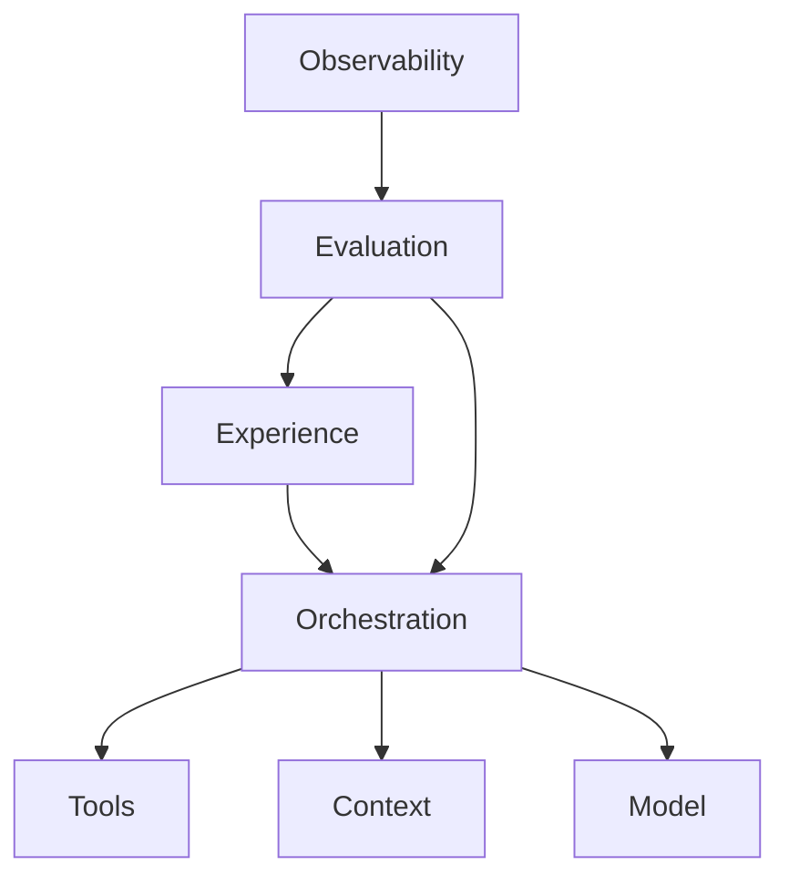

# 03. Seven operating planes

The four decisions establish the skeleton. Seven planes divide the running system into surfaces that can be owned, measured, and changed.

A plane is not a product category. It is an operating contract. Each plane has inputs, outputs, state, service targets, budgets, security rules, evidence, and one accountable owner.

## The planes

The diagram shows dependency, not rank. Evaluation and observability cross the stack. Experience is included because user understanding, approval, correction, and recovery are production controls.

## 1. Model

The model plane owns capability supply. It selects approved models for task classes, controls provider adapters, pins versions where consistency matters, and measures quality, latency, refusal, and cost.

Its owner produces a model registry, routing policy, capability evals, regression results, and a rollback rule. A provider's public benchmark is input to research, never release evidence for your task.

## 2. Context

The context plane owns what the model can know during a run. It covers system instructions, examples, retrieved records, conversation history, memory, source provenance, data permissions, and freshness.

Its owner produces a context manifest for each run, retrieval tests, stale-data behavior, redaction checks, and citation evidence. Anthropic recommends tight context, clear tools with little functional overlap, and just-in-time retrieval for information that need not sit in the prompt. [S07](../research/sources.yaml)

## 3. Tools

The tool plane owns the conversion from model intent to system effect. It defines schemas, authentication, scopes, validation, timeouts, idempotency, sandboxing, and result contracts.

Its owner produces a tool registry, threat model, contract tests, side-effect class, approval rule, and audit event. A tool is a privileged API surface with a natural-language caller. Treat it with the same care as any public endpoint, then add defenses for ambiguous intent.

## 4. Orchestration

The orchestration plane owns order, branching, delegation, state transitions, concurrency, budgets, retries, checkpoints, stop conditions, and recovery.

Its owner produces a state-machine description, failure table, run budget, replay test, and operator commands. It also proves why the chosen loop shape is worth its extra uncertainty.

## 5. Evaluation

The evaluation plane owns the definition of acceptable behavior. It turns production outcomes and failure cases into repeatable trials with deterministic checks, calibrated model rubrics, and human judgment.

Its owner produces task banks, environment fixtures, graders, thresholds, baselines, regression reports, and release verdicts. OpenAI recommends early, task-specific evals built from production-shaped data, with automated scoring and human calibration. [S13](../research/sources.yaml)

## 6. Observability

The observability plane owns the record of what happened. It joins model, context, tool, policy, state, outcome, latency, cost, and user events under one trace.

Its owner produces a telemetry contract, redaction policy, retention rules, alerts, incident queries, and sampled trace reviews. OpenTelemetry now maintains GenAI conventions in a separate repository covering spans, metrics, events, MCP, and provider-specific signals. The work is still evolving, so pin the convention version you emit. [S16](../research/sources.yaml)

## 7. Experience

The experience plane owns the human system around the run: intent capture, expectation setting, progress, source display, uncertainty, approval, correction, escalation, and recovery.

Its owner produces user flows with failure branches, approval copy, correction paths, accessibility checks, and behavior metrics. A hidden human gate is an operations defect. A vague confirmation dialog is a security defect.

## Cross-plane contracts

Most serious failures cross planes. A stale policy document enters through context, the model interprets it, orchestration routes to a refund tool, the tool holds a broad token, the interface presents a confident summary, and observability records only the final text. No single component appears broken. The system is.

For each boundary between planes, write a contract:

- model to context: accepted formats, size, source IDs, trust labels;
- model to tools: schema, confidence handling, validation, denied behavior;
- tools to orchestration: result states, retries, duplicate handling;
- orchestration to experience: progress, approval, stop, recovery;
- every plane to observability: required fields and redaction;
- evaluation to every plane: cases, assertions, and release thresholds.

## Ownership test

Ask each plane owner for the last piece of evidence they produced. If the answer is a roadmap, a slide, or another team's dashboard, ownership is nominal.

Real ownership can point to a current contract, a test, a runtime signal, a failure threshold, and a rollback action. The seven-plane matrix in the labs turns that standard into a one-page review.
