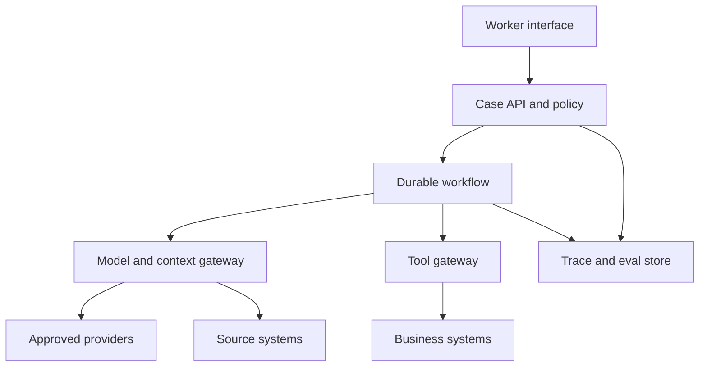
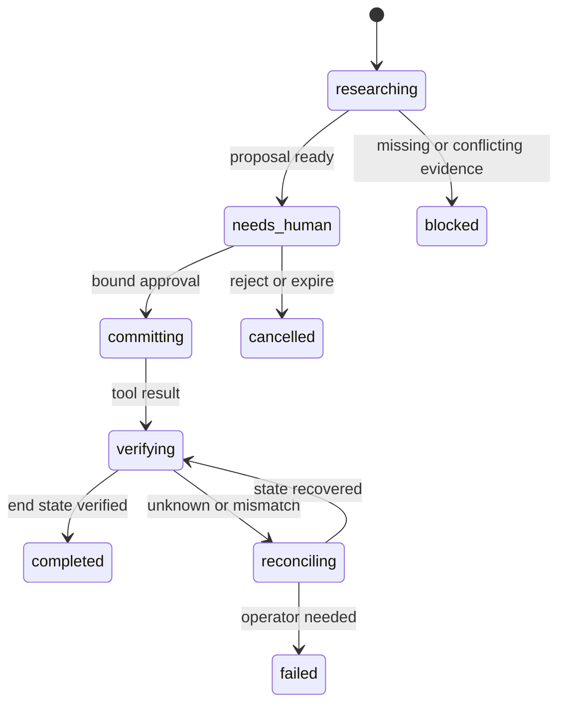

# 12. Reference architecture: a controlled case-resolution agent

This reference design handles a business case that may require research, a proposed decision, human approval, and a consequential write. It is an example, not a claim about a deployed customer system.

The example is useful because it crosses every hard boundary: private context, external content, model choice, tools, durable state, approval, end-state verification, and cost.

## Outcome and limits

The system helps an authorized worker resolve a case. It may gather records, compare current policy, draft a decision, and prepare an action. It cannot commit a consequential write until policy passes and the worker approves the exact action. It stops when sources conflict, access is denied, the budget ends, or the external state cannot be confirmed.

The kill criterion is direct: if the system cannot keep duplicate consequential writes at zero in failure tests, it cannot receive write authority.

## The four decisions

### Model-provider seam

The product calls task contracts such as `classify_case`, `extract_policy_rules`, `compare_evidence`, and `draft_decision`. A router maps each contract to an approved adapter and exact model. Provider message formats, tool encodings, streaming, errors, and usage fields stay below the seam.

Contract tests run against a fake adapter and at least one alternate approved provider. A migration report records quality, safety, latency, and cost gaps.

### Loop shape

Code owns the case state machine. One bounded agent loop may gather and compare evidence inside the `researching` state. Code selects transitions into `needs_human`, `committing`, `verifying`, `completed`, or `failed`.

There is no default multi-agent split. Parallel workers are permitted only for independent source families when the value and deadline justify the extra cost.

### Trust boundary

External content and private records enter context with source IDs, versions, trust labels, and access results. Text inside those records has no authority over tools. A policy engine evaluates the authenticated actor, case, action class, parameters, current policy, and approval.

Read and write credentials are separate. The model process never receives a reusable write credential.

### Long-run home

A durable workflow owns state. Every run has a business idempotency key, checkpoint, budget, policy version, pending action digest, approval state, and stop reason. Approval waits release compute. Tool effects are reconciled before retry.

## Topology

The topology separates intent and policy from model execution. The workflow owns time and state. The tool gateway owns effects. The trace joins their evidence.

## Run sequence

1. The worker opens a case. The interface states permitted actions and current data scope.
2. The Case API authenticates the worker and creates a run with task class, risk class, and budget.
3. The workflow retrieves private records through authorized read tools.
4. The context gateway fetches current policy and external evidence, recording source identity, time, version, and trust class.
5. The router selects an approved model for the task class and logs its reason.
6. The agent loop proposes research steps within the allowed read tools and budget.
7. A deterministic policy stage checks evidence sufficiency, conflicts, freshness, and required fields.
8. The model drafts a decision and structured action proposal. It cannot commit.
9. The policy engine evaluates the proposal. A denial ends or redirects the run.
10. The interface shows the exact action, supporting sources, policy version, uncertainty, and reversibility.
11. Approval creates a single-use token bound to the action digest and expiry.
12. The tool gateway commits with the business idempotency key.
13. The workflow queries the business system to verify the end state.
14. The interface reports the verified result and operation ID. The eval sampler records the run class.

## State model

Every transition writes an event with actor, prior state, next state, version, and reason code. The workflow does not infer completion from the final model message.

## Plane ownership

| Plane | Owner | Core artifact | Release gate |
|---|---|---|---|
| model | AI platform | route registry and adapter contracts | capability and regression bank |
| context | data product owner | context manifest and freshness rules | access, provenance, poisoning cases |
| tools | service owner | tool registry and side-effect classes | policy, schema, idempotency tests |
| orchestration | workflow team | state machine and run budget | failure injection and replay |
| evaluation | quality owner | task bank and calibrated graders | outcome, path, safety, economics |
| observability | platform operations | telemetry contract and incident queries | trace completeness and redaction |
| experience | product owner | intent, progress, approval, recovery flows | comprehension and failure-branch tests |

## Evidence objects

The design produces evidence while it runs:

- `run_manifest`: versions, identity class, task, budget;
- `context_manifest`: sources, trust, access, freshness, compaction;
- `policy_event`: action, policy version, decision, reason codes;
- `approval_receipt`: actor, action digest, display version, expiry;
- `tool_receipt`: operation, idempotency key, result state;
- `outcome_receipt`: queried end state and assertions;
- `cost_record`: tokens, tools, infrastructure, review, correction;
- `eval_link`: dataset and case created from the run, when sampled.

These records support incident response, model comparisons, compliance review, and public case studies after sensitive data is removed.

## Failure table

| Failure | State | Automatic action | Human action |
|---|---|---|---|
| source unavailable | researching | try allowed alternate or stop | supply source or accept block |
| sources conflict | blocked | preserve both and explain | choose authority or update policy |
| injection asks for write | blocked | deny, record security event | review source and route |
| model budget ends | blocked | checkpoint and stop | raise budget or narrow goal |
| approval expires | cancelled | invalidate token | review fresh proposal |
| tool response lost | reconciling | query by idempotency key | inspect if state remains unknown |
| end state differs | reconciling | stop further action | repair or compensate |
| provider outage | blocked or fallback | use approved route only | accept delay or approved substitute |

## Protocol choices

MCP can connect the model host to approved read tools or data servers, subject to local identity and policy. [S08](../research/sources.yaml) [S09](../research/sources.yaml) A2A can connect an independently operated specialist agent when ownership or vendor boundaries justify it. It is unnecessary for local modules in this design. [S10](../research/sources.yaml)

A durable workflow product can implement retries, approval waits, callbacks, and long-running state, but the architecture depends on the contract, not on one vendor. [S11](../research/sources.yaml)

## Proof before write authority

The route must pass:

1. representative capability and regression cases;
2. cross-tenant and privilege tests;
3. direct and indirect injection cases;
4. approval digest and expiry tests;
5. duplicate, timeout, crash, and lost-response tests;
6. end-state verification and compensation tests;
7. cost and p95 latency thresholds;
8. a fresh-context review of evidence pointers.

Only then should the accountable human grant a production write scope. The scope remains narrow, observable, and revocable.
