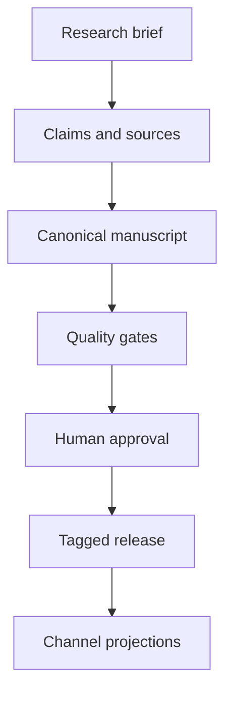
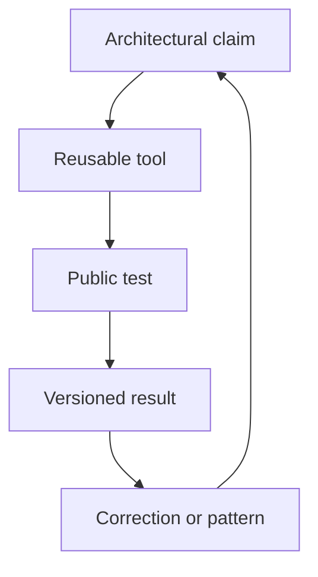

# Publishing system

## One source, several projections

GitHub owns manuscript text, claim records, source records, templates, and release receipts. Notion is the editorial control surface. Google Drive is reserved for review copies and signed exports. Web, PDF, EPUB, audio, and Academy lessons are projections of the same tagged edition.

There is no round-trip sync. Editors change the canonical Markdown through a pull request. A correction made in a projection must return as a canonical pull request before the next export.

## Edition flow

## Release procedure

1. Refresh volatile sources and update `verified_on` fields.
2. Run `node guide/scripts/check-guide.mjs`.
3. Request the named security review and independent verification.
4. Resolve findings through pull requests. Never edit a release receipt.
5. Ask the accountable author to approve the edition.
6. Merge, tag `guide-YYYY.N`, and record the commit SHA.
7. Produce channel files from that SHA.
8. Write `releases/YYYY-N.md` with hashes and public URLs.
9. If a factual correction is needed, issue a new patch edition and link both receipts.

## Authority flywheel

The guide earns authority through repeated proof:

This produces a durable body of work: the book explains the method, the labs let readers apply it, the repository shows revisions, and release receipts show what was true at publication time.
