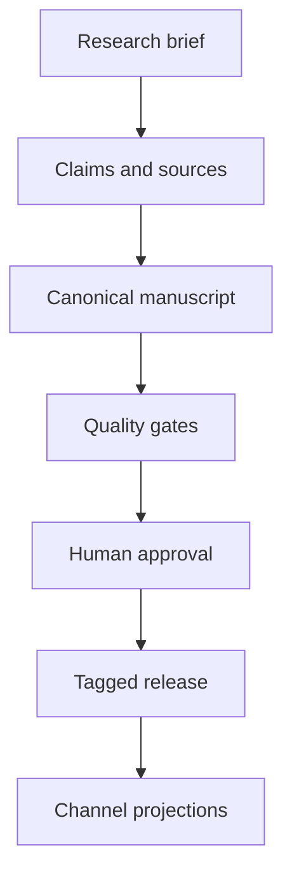
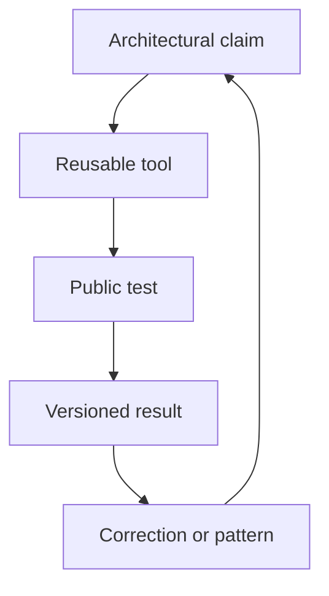

# Publishing system

## One source, several projections

GitHub owns manuscript text, claim records, source records, content relationships, templates, benchmark data, and release receipts. Notion is the editorial control surface. Google Drive is reserved for review copies, rights records, approvals, and signed exports. Web, PDF, EPUB, audio, and Academy lessons are projections of the same tagged edition.

There is no round-trip sync. Editors change the canonical Markdown through a pull request. A correction made in a projection must return as a canonical pull request before the next export.

## Edition flow

## Release procedure

1. Refresh volatile sources and update `verified_on` fields.
2. Run `node guide/scripts/check-guide.mjs`.
3. Request the named security review and independent verification.
4. Resolve findings through pull requests. Never edit a release receipt.
5. Ask the accountable author to approve the edition.
6. Merge, tag `guide-YYYY.N`, and record the commit SHA.
7. Produce channel files from that SHA.
8. Write `releases/YYYY-N.md` with hashes and public URLs.
9. If a factual correction is needed, issue a new patch edition and link both receipts.

## Authority flywheel

The guide earns authority through repeated proof:

This produces a durable body of work: the book explains the method, the labs let readers apply it, the repository shows revisions, and release receipts show what was true at publication time.

## Product rhythm

The publishing system has four named products:

| Product | Job | Timing |
|---|---|---|
| *Building Intelligence That Compounds* | Frank's first-person doctrine and approved experience | evergreen book |
| *AI Architect Guide* | neutral technical method and evidence | living draft plus annual freeze |
| *AI Architect Briefing* | dated change and one architect decision | monthly when signal warrants |
| *AI Architect Ultimate* | frozen guide, change report, labs, results, templates, and receipts | annual gated release |

The FrankX blog, research hub, Signal Loop newsletter, and Academy are distribution or learning surfaces. Their relationships are declared in [content-graph.yaml](content-graph.yaml). Use the [monthly briefing template](monthly-brief-template.md) and [annual Ultimate template](annual-ultimate-template.md) for new records.

## Monthly promotion path

1. Reopen high-volatility sources and record any source delta.
2. Add or change claim records.
3. Write a field note that separates observation, experience, and inference.
4. Publish an `AAB-YYYY-MM` canonical briefing if the change affects an architecture decision.
5. Project standalone analysis to the blog and Frank's editorial letter to Signal Loop.
6. Promote a stable method into the guide and an Academy lab.
7. Feed field results and corrections into the next issue and annual candidate.

The calendar may produce an explicit “no material change” record. It must not manufacture an issue to satisfy cadence.

## Estate decision gate

AI Architect Academy is intended to be the technical curriculum and proof layer. Current estate documents disagree on whether it is an active product or a redirect history repository. Domain, redirect, or ownership changes require Frank's recorded approval before execution. The conflict is tracked in [content-graph.yaml](content-graph.yaml) and the [authority system](../strategy/authority-system.md).
