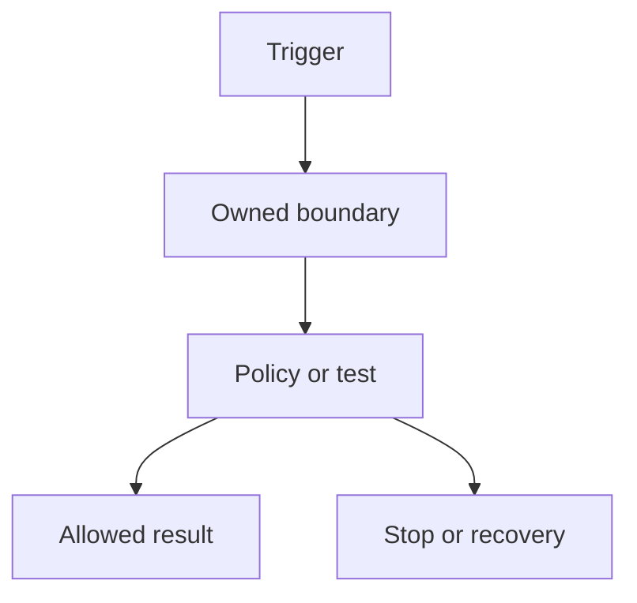

# AI Architect Briefing: YYYY-MM

**Issue ID:** `AAB-YYYY-MM`  
**Evidence cutoff:** `YYYY-MM-DD`  
**Canonical commit:** `TBD before release`  
**Guide edition affected:** `YYYY.N`  
**Status:** research, draft, review, candidate, or released

## Executive decision

State the one decision a senior architect should make or reconsider. Give the reason, consequence, and confidence in 100 to 180 words.

## What changed

| Change | Previous state | Current state | Source IDs | Confidence | Next review |
|---|---|---|---|---|---|
| | | | | | |

## Architecture consequence

Name the affected hard-to-reverse decision, runtime plane, lifecycle stage, cross-cutting concern, and deployment mode. Explain the boundary that moved.

## Tested pattern

Describe one pattern, its fit, its failure mode, and the evidence needed to adopt it.

## Two-hour field test

**Question:**  
**Inputs:**  
**Steps:**  
**Pass condition:**  
**Evidence output:**  
**Cleanup:**

## Frank's field note

Write 250 to 500 first-person words. Separate direct experience, interpretation, and unresolved belief. Link an approved experience record for any employer, customer, result, or historical claim.

## Canonical changes

| Object | Added | Changed | Retired | Link |
|---|---|---|---|---|
| Source records | | | | |
| Claim records | | | | |
| Guide sections | | | | |
| Labs | | | | |
| Field results | | | | |

## Projection pack

| Channel | Job | Required link back |
|---|---|---|
| FrankX blog | searchable standalone analysis and diagram | monthly issue and claim IDs |
| Signal Loop | editorial letter, decision, and reader test | monthly issue |
| Research hub | source delta, data, and benchmark result | field result or claim ledger |
| AI Architect Academy | lab and assessment after method stability | guide section and claim IDs |

## Uncertainty and correction path

List what remains uncertain, what would change the decision, who owns the next check, and the review date. Corrections enter the canonical repository before projection updates.

## Release checklist

- [ ] High-volatility sources were reopened during the evidence window.
- [ ] Every factual statement maps to current claim records.
- [ ] Experience claims have approved wording and rights status.
- [ ] The test ran from a fresh environment or carries a stated limitation.
- [ ] Security and legal implications received the needed review.
- [ ] Blog and Signal Loop drafts point back to the canonical issue.
- [ ] The issue records its commit, date, and correction path.
