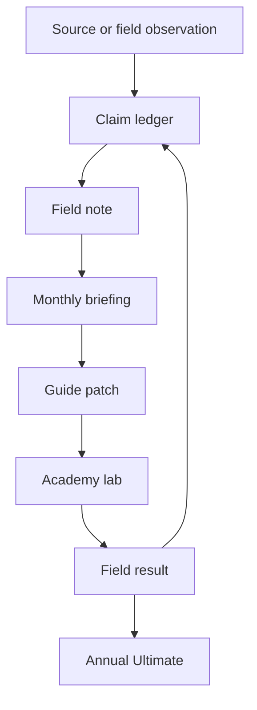
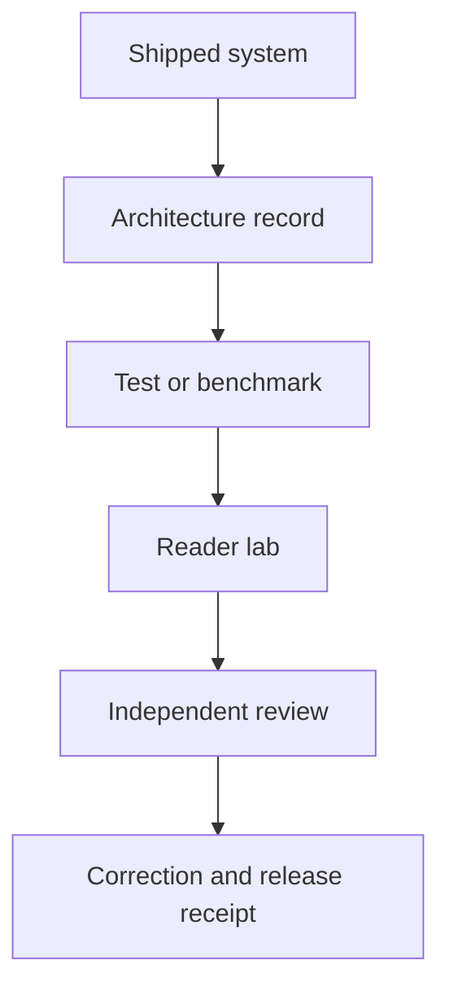

# AI Architect authority system

## Decision

Build one intellectual system with two books, one monthly change stream, one annual package, and several channel projections.

The books have different jobs. The personal book establishes Frank's doctrine through lived decisions. The guide gives the field a neutral, inspectable method. Monthly briefings track change. The annual Ultimate freezes the year's best verified material into a dated package.

## Product architecture

| Product | Working title | Voice | Primary reader | Job | Cadence | Canonical home |
|---|---|---|---|---|---|---|
| Personal flagship | *Building Intelligence That Compounds* | first person | technical founder, architect, senior operator | explain the doctrine, its origin, and the decisions behind it | evergreen book with controlled revisions | book repository |
| Technical reference | *AI Architect Guide 2026* | neutral field-guide voice | senior architect, CTO, platform lead | give a versioned architecture method, evidence, patterns, and tools | living draft plus frozen annual edition | this GitHub directory |
| Monthly change note | *AI Architect Briefing: YYYY-MM* | Frank's editorial voice | guide reader and newsletter subscriber | explain one meaningful change and the decision it alters | monthly | GitHub record, projected into Signal Loop |
| Annual package | *AI Architect Ultimate 2027* | mixed, clearly labeled | practitioner adopting the system | bundle the frozen guide, change report, patterns, labs, benchmark results, and templates | annual | tagged GitHub release with fixed exports |
| Blog analysis | topic-led article | Frank's public voice | search and referral audience | answer one standalone question with a diagram, evidence, and next action | derived from research and monthly work | frankx.ai blog repository |
| Academy lab | task-led instruction | teaching voice | practitioner proving skill | turn a stable claim or tool into an exercise, assessment, and evidence artifact | after method stability | AI Architect Academy repository |

The planned personal book should absorb the overlapping concept currently called *The Intelligence Systems Playbook*. Keep one title once Frank approves the change.

## One content graph

Blog posts and Signal Loop issues are projections from a field note or monthly briefing. They do not become separate sources of truth. A public correction returns to the claim ledger and canonical guide before later projections are updated.

## Channel contracts

### GitHub

GitHub owns canonical text, source and claim records, content relationships, code, labs, benchmark data, corrections, release tags, and receipts. Every public artifact carries an edition or issue ID and a canonical commit reference where practical.

### Notion

Notion owns editorial status, assignments, decisions, review notes, evidence requests, and the release calendar. It points to canonical GitHub objects. It does not own final manuscript text.

### Google Drive

Drive owns review copies, annotated exports, signed approvals, contracts, rights records, and fixed files sent to external reviewers. Accepted edits return through a GitHub pull request.

### FrankX blog and research hub

The blog is the searchable explanation layer. The research hub is the evidence and benchmark entry point. Each post should link to its claim IDs, guide section, lab, briefing issue, and correction path where those objects exist.

### Signal Loop newsletter

Use the existing Signal Loop newsletter. Add `AI Architect Briefing` as a named monthly stream within it. A second newsletter would split subscribers, archives, and editorial energy. The monthly issue gives Frank room to state what changed, what he believes, and what the reader should decide.

### AI Architect Academy

The Academy is the technical curriculum and proof layer for this system. Stable guide decisions become labs. Completed labs create evidence of reader capability and reveal where the method fails in practice.

There is an unresolved estate conflict: one repository document describes AI Architect Academy as a redirect or historical template, while another estate contract describes it as the broader technical architecture property. Do not change redirects, domains, or brand ownership until Frank records one decision. The proposed decision is to keep AI Architect Academy as the technical product and curriculum layer, with Starlight Intelligence Academy serving its separate operator-learning mission.

## Monthly briefing contract

Each issue must answer:

1. What changed since the prior issue?
2. Which boundary, lifecycle stage, or cross-cutting concern changed?
3. What decision should a senior architect reconsider?
4. What did Frank or a cited source observe?
5. What can the reader test in under two hours?
6. Which claims, chapters, diagrams, or labs changed?
7. What remains uncertain, and when will it be checked again?

Default issue budget:

| Element | Target |
|---|---|
| Executive decision | 100 to 180 words |
| Change analysis | 600 to 1,000 words |
| Architecture pattern | one diagram plus 400 to 700 words |
| Test or lab | one reproducible task |
| Source delta | added, changed, retired, and next review dates |
| Field note | 250 to 500 words in Frank's voice |

An issue can be short when the month does not justify a large update. Cadence never outranks signal.

## Annual Ultimate contract

The annual package is a release, not a third book. It contains:

- the frozen annual guide;
- a year-in-change report;
- the accepted pattern catalog;
- a model, protocol, regulation, and platform atlas dated to the verification window;
- labs and assessments tied to guide claims;
- benchmark methods, data, results, and limitations;
- templates, decision records, and review checklists;
- a source and claim snapshot;
- an errata file and release receipt.

The annual candidate opens in July, freezes volatile research in September, receives specialist review in October, and targets release after every gate passes. The year in the title refers to the evidence date, not a marketing deadline.

## Authority standard

Public authority is the accumulated proof trail:

Track proof, not status claims.

| Signal | Evidence |
|---|---|
| architectural judgment | decision record with alternatives and reversal cost |
| technical depth | inspectable reference implementation and tests |
| practical value | verified task outcome, cost, latency, and operator result |
| teaching quality | lab completion, assessment evidence, and learner feedback |
| intellectual honesty | limitations, rejected claims, corrections, and review dispositions |
| field relevance | current source ledger and dated monthly deltas |
| independent trust | named reviews, public citations, and reproducible results |

Never invent reviewer credit, customer results, employer approval, implementation counts, or claims that Frank is the world's leading architect. The system is designed to make excellent work visible and testable. Recognition is an external result.

## Editorial roles

Recruit named reviewers only after the draft reaches its scope gate:

| Review lens | Required question |
|---|---|
| distributed systems and platform | Can state, retries, capacity, tenancy, and recovery survive real failure? |
| AI security and red team | Can identity, delegated authority, data, tools, memory, code, and inter-agent traffic be abused? |
| data, privacy, and rights | Are data origin, use rights, retention, deletion, and regional controls defensible? |
| governance and legal | Do decision rights, classification, exceptions, and evidence match current duties? |
| evaluation, MLOps, and FinOps | Are results repeatable, changes controlled, and unit economics tied to value? |
| technical learning | Can the intended reader apply and prove the method without private context? |

## Build sequence

### Days 1 to 30: establish the system

- Approve the two-book split and final names.
- Resolve the Academy ownership and redirect conflict.
- Add the coverage shell and missing chapter briefs to the guide.
- Create monthly issue IDs, content links, and editorial states.
- Define the first public benchmark and its data-rights boundary.
- Open reviewer recruitment briefs without assigning unconfirmed names.

### Days 31 to 60: create proof

- Build the data and knowledge architecture lab.
- Build the agent identity and delegated authority lab.
- Add one enterprise, one realtime multimodal, and one sovereign reference architecture.
- Run the first benchmark and publish raw results with limitations.
- Draft the personal book's first four chapters from approved experience records.
- Publish the first monthly briefing through Signal Loop and the blog.

### Days 61 to 90: close the loop

- Run specialist reviews and record every disposition.
- Turn benchmark findings into guide changes and Academy assessments.
- Issue the second and third monthly briefings.
- Produce a release candidate with hashes and fixed exports.
- Publish only if security, rights, legal, verification, and author gates pass.
- Review conversion, citations, lab evidence, corrections, and reader decisions for the next quarter.

## Scorecard

The editorial control room should report these measures each month:

| Measure | Healthy signal |
|---|---|
| evidence freshness | no overdue high-volatility claim |
| coverage | every release-blocking domain has an owner and proof artifact |
| reproducibility | a fresh reader can rerun the current benchmark and labs |
| review | every material finding has an owner, disposition, and link |
| correction time | confirmed material error receives a canonical patch promptly |
| content reuse | each monthly briefing links to the claim, guide, blog, newsletter, and lab objects it changed |
| authority quality | growth in qualified citations, lab completions, reviewer participation, and invited technical work |

Follower count and page views can inform distribution. They do not substitute for proof.
